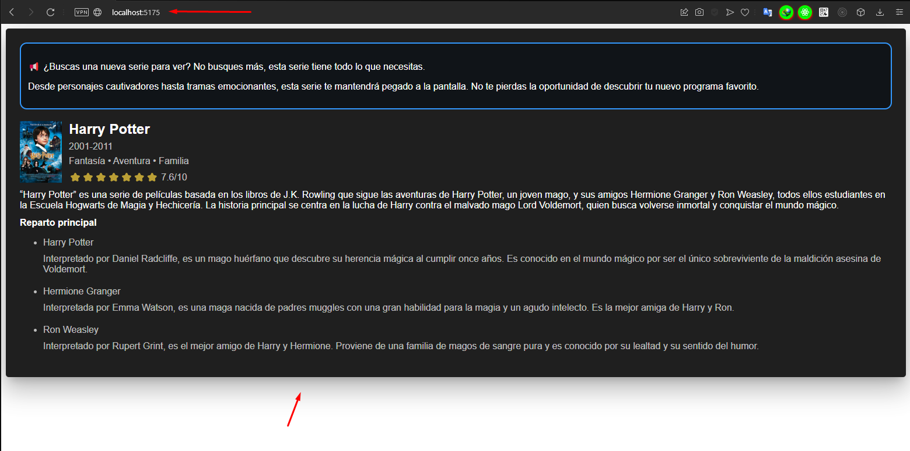

# Proyecto Remoto 2/2 - MultiLingual MicroFrontends con Vite, React y Redux

Este es un proyecto remoto que se integra con el proyecto host principal [https://github.com/dennysjmarquez/MultiLingual-MicroFrontends-vite-react-redux-Host](https://github.com/dennysjmarquez/MultiLingual-MicroFrontends-vite-react-redux-Host), **para una documentación detallada, consulte el proyecto principal.**

Este proyecto expone un componente que muestra información sobre la serie **[Harry Potter]** y sus actores principales.
Este componente se integra con el proyecto host a través de la Federación de Módulos.



## **Características**

- **Module Federation**: Este proyecto utiliza Module Federation para permitir la integración con el proyecto host.
- **Componentes de orden superior**: Este proyecto utiliza componentes de orden superior para escuchar eventos del proyecto host y compartir la tienda Redux.
- **Redux**: Este proyecto utiliza Redux para el manejo del estado.
- **Internacionalización**: Este proyecto utiliza i18next para la internacionalización.

## **Exposición del componente**

Este proyecto utiliza la Federación de Módulos para exponer el componente de la serie. Esto se configura en el archivo `vite.config.js` del proyecto.

Aquí hay un resumen de cómo se configura la Federación de Módulos:

```javascript
federation({
	// Configura el plugin de Module Federation.
	name: 'remoteMovieList2', // Define el nombre del remoto.
	filename: 'remoteEntry.js', // Define el nombre del archivo de entrada remoto.
	exposes: {
		// Define los módulos que se exponen.
		'./MovieList': './src/components/MovieList'
	},
	shared: ['react', 'react-dom', 'react-redux'] // Define los módulos compartidos.
})
```

Este código expone el componente MovieList bajo el nombre ./MovieList. También comparte los módulos react, react-dom y react-redux con el proyecto host y otros proyectos remotos.

## **Cómo usar la aplicación**

1. **Instalar las dependencias**: Ejecuta el comando `yarn` en el directorio del proyecto para instalar las dependencias.
2. **Iniciar el proyecto**: Ejecuta el comando `yarn build && yarn preview` o `yarn start` para iniciar el proyecto. Debería estar accesible en `http://localhost:5175`

Recuerda que este proyecto remoto se integra con el proyecto host. Por lo tanto, necesitarás tener este proyecto remoto en ejecución y accesible antes de iniciar el proyecto host para ver el funcionamiento correcto de la integración.

